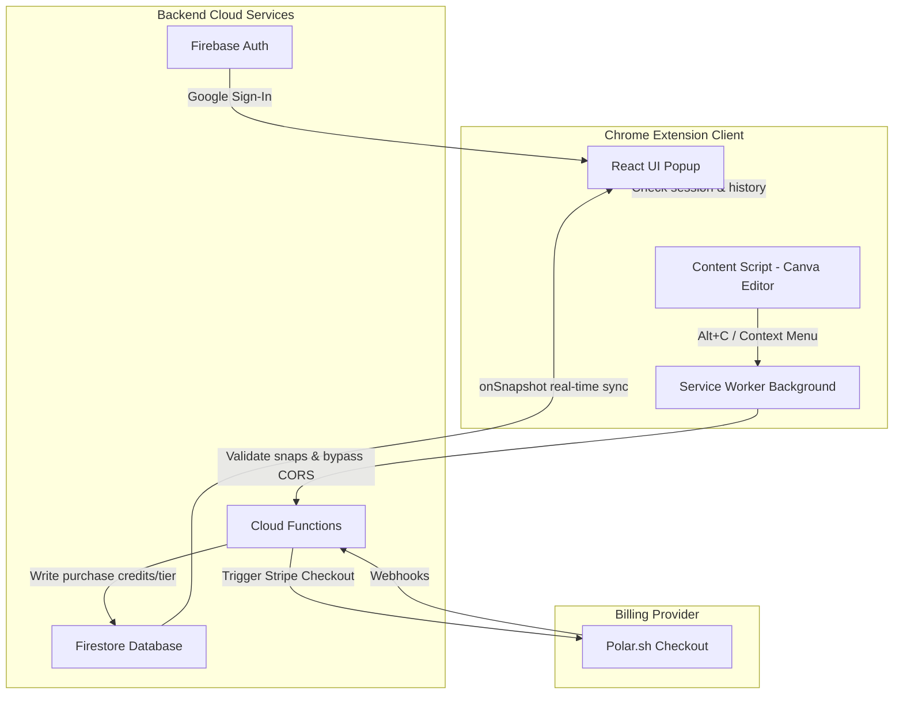

# Product Requirement Document (PRD)

## Project: Canva Snapper (Pro Edition)
* **Version:** 1.1.0  
* **Target Architecture:** Google Chrome Extension (Manifest V3)  
* **Backend:** Firebase (Authentication, Firestore, Cloud Functions)  
* **Billing Provider:** Polar.sh Sandbox & Production  
* **Product Owner:** Steven Sondra Allen Widodo  
* **Admin Email:** `stevenallenofc@gmail.com`

---

## 1. Executive Summary & Value Proposition
**Canva Snapper** is a premium, developer-focused productivity Chrome Extension that optimizes the workflow of UI/UX designers, creators, and visual specialists. It eliminates the repetitive and time-consuming process of exporting design elements from the Canva Editor to external design tools (Figma, Photoshop) or communication platforms (WhatsApp, Slack, Gemini). 

Instead of going through `Canva Export Menu ➡️ Download Zip ➡️ Extract File ➡️ Drag & Drop`, Canva Snapper allows users to hover over any element and press **`Alt + C`** (or right-click to copy) to instantly copy a full-resolution, transparent `image/png` directly to their system clipboard.

### Core Problems Solved:
1. **Workflow Latency:** Eliminates the wait time of Canva's server-side rendering and ZIP file packaging for single-element exports.
2. **Local Storage Clutter:** Prevents the user's `Downloads` folder from being filled with temporary design assets.
3. **Loss of Transparency (Alpha Channel):** Replaces standard system screenshots (which destroy background transparency and add surrounding bounding borders) with direct CDN/DOM image extraction.

---

## 2. System Architecture & Tech Stack



### Frontend Extension:
* **Bundler & Build Tool:** Vite + TypeScript + `@crxjs/vite-plugin`.
* **Framework:** React + Custom CSS/HTML5 APIs.
* **Styling System:** Vanilla CSS + Tailwind CSS v4/v5 (for layouts and pricing details) + Lucide React Icons.
* **Storage Sync:** `chrome.storage.local` for offline session caching and copy history logs.

### Backend Infrastructure:
* **Firebase Authentication:** Handles secure user profiles via Google Sign-In (`chrome.identity`).
* **Firebase Firestore:** Houses user balances, membership tiers, and anonymous guest device fingerprints.
* **Firebase Cloud Functions (Node.js/TypeScript):** Processes transaction validations, stripe checkout sessions via Polar webhooks, and secure snap deduction transactions.

---

## 3. Product Features & User Experience (UX)

### 3.1. Smart DOM & CDN Detection
* **Selector Parsing:** Detects Canva's internal elements (`media-public.canva.com` and public CDN preview `/tl.png` paths) dynamically despite Canva's dynamic, obfuscated CSS class names (e.g., `_7_i_XA`).
* **Trigger Methods:** Supports both the keyboard shortcut **`Alt + C`** (configurable) and right-click Context Menu items ("Copy Canva element").

### 3.2. Canvas API Offscreen Upscaling & CORS Bypass
* **Quality Preservation:** Renders the source CDN asset on an offscreen HTML5 Canvas in its original *natural resolution* (natural width/height) instead of the scaled CSS dimensions visible on screen.
* **CORS Bypass:** If the canvas is marked "tainted" by Chrome's cross-origin policies, the request is proxy-routed through the background service worker using a secure fetch loop with `crossOrigin = "anonymous"`.

### 3.3. Premium Extension Popup UI
* **Design Aesthetic:** Tailored to designers—resembling Linear or Figma with curated dark/light color tokens, smooth gradients, and tactile micro-interactions (e.g., scale-down buttons on active click).
* **Library History Panel:** Displays thumbnails of the last 5 successful snaps with dimensions and quick copy/re-download buttons.
* **Workspace Toggle:** A quick switch to pause or activate the snapper context listeners.

### 3.4. Auto-Download (Pro Feature)
* **Workflow:** Allows Pro tier users to automatically download a copy of the snapped image to their computer's local storage whenever they copy an asset to their clipboard.
* **Supported Formats:** Off, WebP (preserves transparency), or JPEG (flattens canvas).

---

## 4. Business Model & Credit Logic

Canva Snapper uses a hybrid business model combining Credit Packs (one-time purchases) and a Pro Subscription (monthly/lifetime).

| Tier | Credits | Access Rights | Tracking Method |
| --- | --- | --- | --- |
| **Guest (Trial)** | 3 snaps | Free trial access (cannot purchase). | Unique hardware instance ID combined with local salt fingerprint. |
| **Registered (Free)** | 10 snaps | Upgraded upon signing in with Google. | Firebase UID (`users` collection). |
| **Starter Pack ($3.99)** | +25 snaps | One-time credit addition, cumulative. | Firebase UID balance. |
| **Creator Pack ($4.99)** | +75 snaps | One-time credit addition, cumulative. | Firebase UID balance. |
| **Pro Monthly ($7.99/mo)** | Unlimited | Unlimited snaps, credit check bypassed. | Firebase UID tier (`pro`). |
| **Lifetime Pro ($7.00 promo)** | Unlimited | Unlimited snaps, permanent access. | Firebase UID tier (`pro`). |

### 4.1. Real-Time Sync Channel
* **Under the hood:** Rather than forcing users to log out and log back in to sync their snaps balance after a payment, the extension background script uses a persistent Firestore `onSnapshot` real-time listener on `users/{uid}`.
* **Sync Speed:** Updates the local session storage state within 500ms of the webhook write.

### 4.2. Interactive Celebration Animations
* **Animated Counter:** Uses a lightweight `requestAnimationFrame` ease-out cubic loop to roll credit counts up smoothly over 1.2s instead of snapping values instantly.
* **Toast Overlay:** A celebratory screen overlay featuring bouncing sparkles and clear feedback messages (`+X snaps added!` or `PRO UNLOCKED!`) when credit balances or tiers increase.

---

## 5. Billing & Checkout System

### 5.1. Polar.sh Webhook Integration
1. The user clicks **Select** on the Pricing view in the extension.
2. If Guest, they are intercepted by a slide-up login modal asking them to continue with Google first.
3. If logged in, a Cloud Function (`createCheckoutSession`) contacts Polar.sh, registers the customer email, and generates a Stripe checkout URL.
4. The extension opens the checkout page.
5. Upon successful checkout, Polar fires a webhook to the Cloud Function, updating `users/{uid}` with their newly bought credits or `pro` membership tier status.

### 5.2. Payment Success Redirect Page
* **Path:** Located at `https://canva-snapper-pro-9e1b3.web.app` (Firebase Hosting).
* **UX Details:**
  * Clean, minimal success card with a pulsing green badge showing `Paid (Sandbox)` or `Paid`.
  * Truncated Checkout ID at the footer with a copyable text/link interface (displays green "Copied!" feedback on hover/click).

---

## 6. Security & Admin Guardrails

### 6.1. Admin Owner Console
* **Path:** `admin.html` (resolves to `/src/admin/main.tsx`).
* **Permissions Control:**
  * **Frontend Gate:** Restricts view to the logged-in user `stevenallenofc@gmail.com`. Any other user trying to load the console gets redirected to an red "Access Denied" screen.
  * **Backend Firestore Rules:** All writes to `/users` and `/device_fingerprints` are locked down to requests originating from `stevenallenofc@gmail.com`:
    ```javascript
    function isAdmin() {
      return request.auth != null && request.auth.token.email == "stevenallenofc@gmail.com";
    }
    ```

---

## 7. Branding & Assets

### 7.1. Clean Transparent Application Icons
* **Files:** `icon16.png`, `icon32.png`, `icon48.png`, `icon128.png` in `public/` and `dist/`.
* **Processing:** Regenerated from a high-resolution 1024x1024 logo file. An automated PowerShell image script strips out the white rounded card background, erases the crop corner brackets, and resizes the central hand V-sign & colored blob to fill the canvas with transparent pixels. This ensures the extension icon looks bold, clean, and professional in Chrome's dark/light menus.